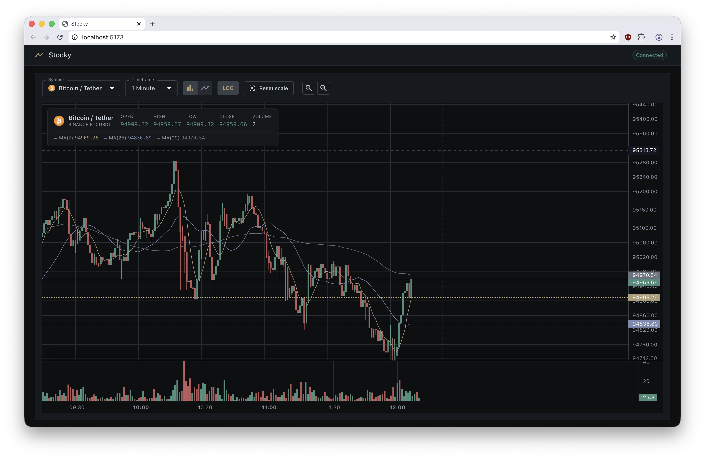

# Stocky

Stocky is a real-time market analytics dashboard that tracks both cryptocurrency pairs and select US equities. It uses a Go backend to ingest live Finnhub trades and a React + TypeScript frontend for visualization. The project emphasizes low-latency streaming, transparent data persistence, and a modern, responsive UI.



## Features

- **Low-Latency Streaming:** Direct WebSocket fan-out keeps UI latency low without compromising correctness.
- **Real-Time UI:** Legend and chart widgets use refs + imperative updates to keep interactivity smooth even during heavy trade bursts.
- **Multi-Chart Visualization:** Switch between **Candlestick**, **Line**, and **Area** views with synchronized volume panes.
- **Persistent Storage:** Raw trades are archived into PostgreSQL, with scheduled jobs rolling them into 1-minute candles for long-term retention.
- **Gapless History:** The `/api/history` endpoint merges archived candles with live trades to avoid gaps during archival cycles.
- **AI Signals (Optional):** A Python-based agent generates BUY/SELL/HOLD signals and writes them into the same database, exposed via `/api/signal`.
- **Configurable Logos:** Metadata mapping serves light-weight logos for both crypto and equities with fallbacks when remote assets fail.

## Stack

### Backend (Go)
- **WebSocket Fan-out:** Broadcasts live Finnhub payloads to connected clients while also persisting them to memory + Postgres.
- **DB Worker Pool:** Dedicated goroutine pool prevents spikes in trade volume from blocking ingestion.
- **Signal APIs:** REST endpoints expose historic OHLC data, latest price snapshots, and optional AI-generated signals.
- **Archival Jobs:** Background tasks aggregate raw trades into 1-minute candles and prune old rows.

### Frontend (React + TS)
- **Imperative Legend:** `useImperativeHandle` updates legend values without re-rendering the entire layout.
- **Chart Syncing:** Dual price/volume panes stay aligned through logical-range subscriptions and manual debounce.
- **State Persistence:** LocalStorage caches last selected symbol, interval, and chart type.
- **Signal Widget:** Optional component listens for broadcasted AI signals and surfaces entry/exit context.

## Setup

### Option 1: Docker Compose (Recommended)

```bash
git clone https://github.com/destucr/stocky.git
cd stocky
cp .env.example .env
# Edit .env and add your FINNHUB_API_KEY
docker-compose up
```

Open `localhost:5173` in your browser.

### Prerequisites
- Go 1.24+
- Node.js 18+ and npm
- PostgreSQL 15+ (or compatible managed instance)
- Finnhub API key (for realtime data)

**Prerequisites:** Go 1.24+, Node.js, PostgreSQL

**1. Clone the repository**
```bash
git clone https://github.com/destucr/stocky.git
cd stocky
```

2. **Backend Setup:**
   - Copy `.env.example` (if present) or set `FINNHUB_API_KEY`, `DB_HOST`, `DB_PORT`, `DB_USER`, `DB_PASSWORD`, and `DB_NAME`.
   - In `backend/`: `go run main.go` (or `docker-compose up` to start backend + Postgres + optional agent).

3. **Frontend Setup:**
   - In `frontend/web/`: `npm install`
   - Development server: `npm run dev`
   - Production build: `npm run build` then serve `frontend/web/dist`

4. **Optional AI Agent:**
   - Requires Python 3.10+, pandas, scikit-learn, and access to the same Postgres.
   - See `TRADING_SYSTEM.md` for research context and `agent/README.md` for deployment instructions.

## License

Apache License 2.0
